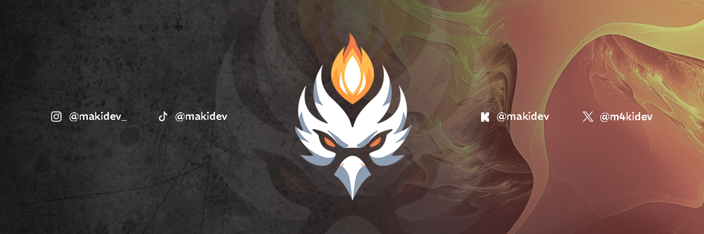

# 💻 MAKIDEV - Web Developer

## 🚀 About Me
Hello, my name is *Juan Pablo*, although I'm better known online as **MAKIDE**, a passionate web developer in constant learning. I love building projects and exploring new technologies.

## 🛠️ Technologies and Tools

- 🌐 HTML | CSS | JavaScript
- 🛠️ Git | GitHub

## 📌 Featured Projects

1. **[Project Name 1](REPOSITORY_URL)** - Brief description
2. **[Project Name 2](REPOSITORY_URL)** - Brief description.  
3. **[Project Name 3](REPOSITORY_URL)** - Brief description.  

## 📊 GitHub Stats

<a href="https://github.com/M4KIDEV">
  
<!--    -->
</a>

## 📫 Connect with Me
- LinkedIn: [m4kide](https://www.linkedin.com/in/m4kide)
- Instagram: [@m4kide](https://www.instagram.com/m4kide/)
- YouTube: [@m4kide](https://www.youtube.com/@m4kide)
- Twitch: [@m4kidev](https://www.twitch.tv/m4kidev)
- Mail: [m4kidev@gmail.com](mailto:m4kidev@gmail.com)

 
<h3>Thanks for visiting my profile! 🚀</h3>

<!--
**M4KIDEV/M4KIDEV** is a ✨ _special_ ✨ repository because its `README.md` (this file) appears on your GitHub profile.

Here are some ideas to get you started:

- 🔭 I’m currently working on ...
- 🌱 I’m currently learning ...
- 👯 I’m looking to collaborate on ...
- 🤔 I’m looking for help with ...
- 💬 Ask me about ...
- 📫 How to reach me: ...
- 😄 Pronouns: ...
- ⚡ Fun fact: ...
-->
